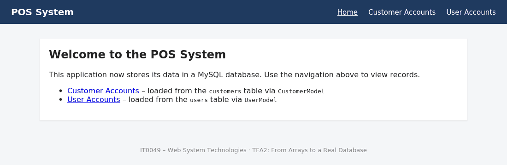
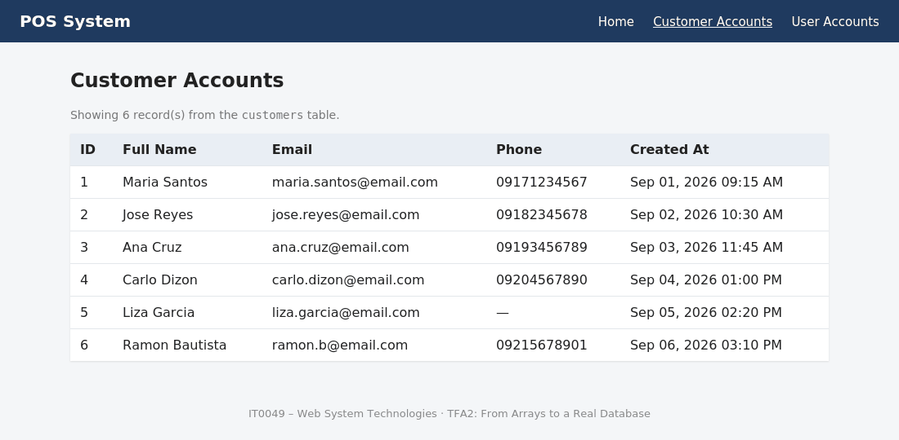
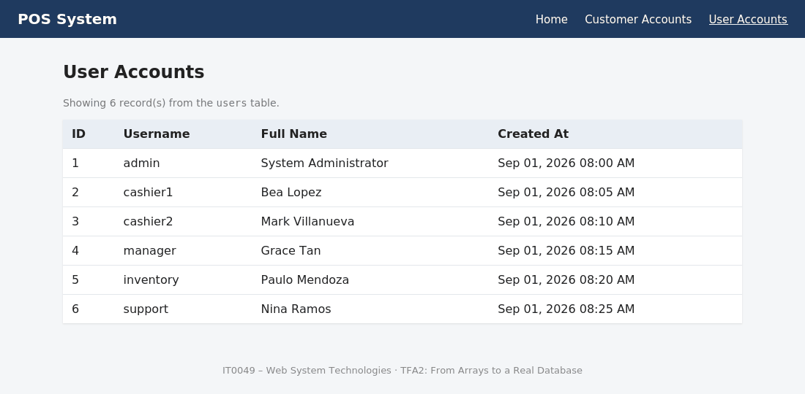
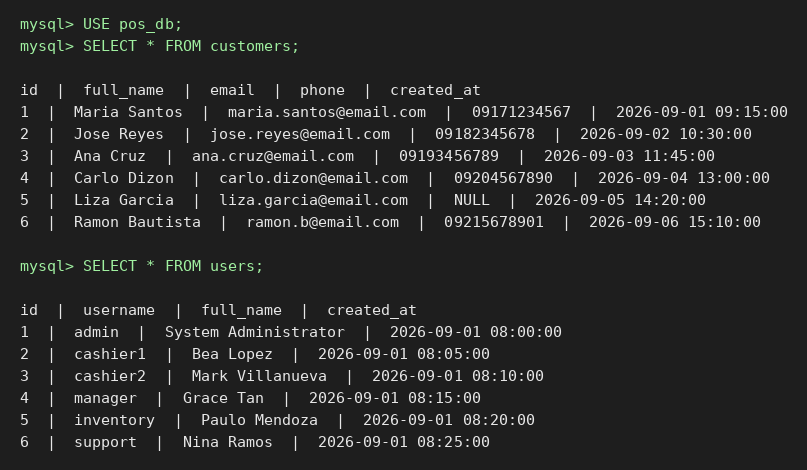

# IT0049 – Technical Formative Assessment 2
## From Arrays to a Real Database (CodeIgniter POS)

| | |
|---|---|
| **Course** | IT0049 – Web System Technologies |
| **Student** | *Jose Luis Pascual* |
| **Section** | *TX33* |
| **Professor** | *Mar Eli C. Sagsagat* |
| **Live Demo** | [https://jolo-pos.site.je]|
| **Repository** | https://github.com/jppascual-ux/IT0049-TFA2-CodeIgniter-POS |

---

## Table of Contents

1. [Overview](#1-overview)
2. [Learning Outcomes Covered](#2-learning-outcomes-covered)
3. [Screenshots](#3-screenshots)
4. [Requirements](#4-requirements)
5. [Step-by-Step: Running Locally (XAMPP)](#5-step-by-step-running-locally-xampp)
6. [Step-by-Step: Deploying to the Live Site (InfinityFree)](#6-step-by-step-deploying-to-the-live-site-infinityfree)
7. [Database Schema and Sample Data](#7-database-schema-and-sample-data)
8. [How the Code Works (Models → Controllers → Views)](#8-how-the-code-works-models--controllers--views)
9. [Project Structure](#9-project-structure)
10. [Activity Requirements Checklist](#10-activity-requirements-checklist)
11. [Troubleshooting](#11-troubleshooting)
12. [References](#12-references)

---

## 1. Overview

The POS application from TFA1 stored its Customer Accounts and User Accounts data in
**static PHP arrays**, which reset every time the server restarted. This activity replaces
that temporary storage with a **real MySQL database**.

- The `customers` and `users` tables were created from the schema provided in the activity.
- Each table is populated with **6 sample records** (minimum required: 5).
- Two CodeIgniter 4 Models — `CustomerModel` and `UserModel` — wrap the tables.
- The `Customers` and `Users` controllers now call `findAll()` on their Models
  (**Query Builder, no raw SQL**) instead of returning hard-coded arrays.
- The views display the database records the same way the static-array version did —
  only the data source changed.

| Page | Route | Controller | Model | Table |
|---|---|---|---|---|
| Home | `/` | `Home` | – | – |
| Customer Accounts | `/customers` | `Customers` | `CustomerModel` | `customers` |
| User Accounts | `/users` | `Users` | `UserModel` | `users` |

## 2. Learning Outcomes Covered

| ILO from the activity sheet | Where it is fulfilled |
|---|---|
| Configure CodeIgniter's database connection settings | `.env` → `database.default.*` (templates: `.env.example`, `.env.infinityfree.example`) |
| Create a MySQL database and tables using the provided schema | `database/pos_db.sql` |
| Build CodeIgniter Models for the Customer Accounts and User Accounts pages | `app/Models/CustomerModel.php`, `app/Models/UserModel.php` |
| Retrieve records with Query Builder and display them in a view | `app/Controllers/Customers.php`, `app/Controllers/Users.php` → `app/Views/customers/index.php`, `app/Views/users/index.php` |

## 3. Screenshots

### Home page


### Customer Accounts — records loaded from the `customers` table


### User Accounts — records loaded from the `users` table


### Database records (MySQL query output)


### Your own environment screenshots
> After you set up the project, add these screenshots to `docs/screenshots/` so the README documents **your** setup.
> File names are already referenced below — just save the images with these exact names.

| Screenshot | File name | What to capture |
|---|---|---|
| XAMPP Control Panel | `xampp-running.png` | Apache and MySQL both showing green "Running" |
| phpMyAdmin import | `phpmyadmin-import.png` | The success message after importing `pos_db.sql` |
| phpMyAdmin tables | `phpmyadmin-tables.png` | `pos_db` expanded showing `customers` and `users` with row counts |
| Debug Toolbar – Database tab | `debug-toolbar-query.png` | The `SELECT * FROM customers` query generated by Query Builder |
| Live site | `live-customers.png` | `/customers` open on your InfinityFree URL |
| GitHub repo | `github-repo.png` | The repository main page showing the folders |


## 4. Requirements

| Requirement | Notes |
|---|---|
| PHP 8.1 or newer | XAMPP 8.2 / 8.3 recommended |
| PHP extensions: `intl`, `mbstring`, `json`, `mysqlnd`, `mysqli` | All included in XAMPP; enable `intl` in `php.ini` if disabled |
| MySQL 5.7+ or MariaDB 10.3+ | Included in XAMPP |
| Git | https://git-scm.com |
| **Composer is NOT required** | The CodeIgniter 4.6 framework is already included in `system/` |

All tools used are free: XAMPP, VS Code, Git, GitHub, InfinityFree, FileZilla.

## 5. Step-by-Step: Running Locally (XAMPP)

### Step 1 – Install and start XAMPP
1. Download XAMPP from https://www.apachefriends.org and install it with the defaults.
2. Open the **XAMPP Control Panel**.
3. Click **Start** next to **Apache** and **Start** next to **MySQL**. Both should turn green.

### Step 2 – Get the project
```bash
git clone https://github.com/YOUR-USERNAME/IT0049-TFA2-CodeIgniter-POS.git
cd IT0049-TFA2-CodeIgniter-POS
```
(or download the ZIP from GitHub and extract it).

### Step 3 – Check the PHP extensions
Open a terminal and run:
```bash
php -v
php -m
```
Confirm the version is 8.1+ and that `intl`, `mbstring`, and `mysqli` are listed.
If `intl` is missing: open `C:\xampp\php\php.ini`, change `;extension=intl` to `extension=intl`, save, and restart Apache.

### Step 4 – Import the database
1. Open http://localhost/phpmyadmin in your browser.
2. Click the **Import** tab at the top.
3. Click **Choose File** and select `database/pos_db.sql` from the project folder.
4. Scroll down and click **Import** (or **Go**).
5. You should see *"Import has been successfully finished"*. The left sidebar now shows `pos_db` with the tables `customers` and `users`.
6. Click `customers` → **Browse** to confirm 6 rows; do the same for `users`.

### Step 5 – Configure the database connection
1. In the project folder, copy `.env.example` and rename the copy to `.env` (note the leading dot).
2. Open `.env`. The defaults already match XAMPP:
   ```ini
   CI_ENVIRONMENT = development
   app.baseURL = 'http://localhost:8080/'

   database.default.hostname = localhost
   database.default.database = pos_db
   database.default.username = root
   database.default.password =
   database.default.DBDriver = MySQLi
   database.default.port = 3306
   ```
3. Only change `database.default.password` if your MySQL `root` account has a password.

### Step 6 – Start the development server
```bash
php spark serve
```
Output: `CodeIgniter development server started on http://localhost:8080`

### Step 7 – Open the pages
| Page | URL |
|---|---|
| Home | http://localhost:8080/ |
| Customer Accounts | http://localhost:8080/customers |
| User Accounts | http://localhost:8080/users |

### Step 8 – Verify the data really comes from MySQL
1. In phpMyAdmin, open `customers` → **Browse** → click **Edit** on row 1 and change the name.
2. Refresh http://localhost:8080/customers — the change appears immediately.
3. Change it back.
4. At the bottom of the page, open the **Debug Toolbar** → **Database** tab. You will see the
   `SELECT * FROM customers ORDER BY id ASC` query that CodeIgniter's Query Builder generated —
   proof that no raw SQL is written in the application.

## 6. Step-by-Step: Deploying to the Live Site (InfinityFree)

InfinityFree is a free PHP + MySQL host with no credit card required.

### Step 1 – Create the hosting account
1. Register at https://www.infinityfree.com and verify your email.
2. **Create Account** → **Free Subdomain** → choose a name (e.g. `yourname-pos`) → create.
3. Wait until the account status is **Active**, then open the **Control Panel**.
4. **Select PHP Version** → choose the highest 8.x version → Save.

### Step 2 – Create and import the database
1. Control Panel → **MySQL Databases** → name: `pos_db` → **Create Database**.
2. Write down the four values shown: **MySQL Hostname**, **DB Name**, **Username**, **Password**
   (the password is your hosting account password).
3. Click **Admin** next to the database to open phpMyAdmin.
4. Select the database in the left sidebar → **Import** → choose
   **`database/pos_db_tables_only.sql`** (this version has no `CREATE DATABASE` line, which
   shared hosts do not allow) → **Go**.
5. Confirm both tables show 6 rows.

### Step 3 – Prepare the production `.env`
1. Open `.env.infinityfree.example` and fill in your real values:
   ```ini
   CI_ENVIRONMENT = production
   app.baseURL = 'https://yourname-pos.infinityfreeapp.com/'

   database.default.hostname = sqlXXX.infinityfree.com
   database.default.database = if0_XXXXXXXX_pos_db
   database.default.username = if0_XXXXXXXX
   database.default.password = YOUR_ACCOUNT_PASSWORD
   database.default.DBDriver = MySQLi
   database.default.port = 3306
   ```
   Keep the trailing `/` on `app.baseURL`.
2. Save it as `.env.production` (do not overwrite your local `.env`; `.env.production` is git-ignored).
3. Open `app/Config/App.php` and set `$baseURL` to the same live URL as a fallback.

### Step 4 – Upload the files with FileZilla
1. Install **FileZilla Client** (https://filezilla-project.org).
2. Get the FTP details from your InfinityFree account page: hostname (e.g. `ftpupload.net`), username, password, port `21`.
3. Connect using the Quickconnect bar.
4. Enable **Server → Force showing hidden files** so `.htaccess` is visible.
5. In the remote panel open `htdocs/` and delete its default files.
6. Upload **everything** in the project folder into `htdocs/` — `app`, `public`, `system`,
   `writable`, `database`, `docs`, `.htaccess`, `spark`, `README.md`, etc.
   Do **not** upload your local `.env`.
7. Upload `.env.production`, then right-click it on the server → **Rename** → `.env`.
8. Right-click `htdocs/writable` → **File permissions** → `755` → **Recurse into subdirectories** → OK.

The server layout should look like:
```
htdocs/
├── .htaccess      ← routes every request to public/
├── .env           ← production values
├── app/
├── public/
├── system/
├── writable/
└── database/
```

### Step 5 – Test the live site
Open `https://yourname-pos.infinityfreeapp.com/customers` and `/users`.
They should display the same tables as localhost.

### Step 6 – Update this README and push
Replace the **Live Demo** link at the top, add your screenshots to `docs/screenshots/`, then:
```bash
git add .
git commit -m "Add live demo URL and screenshots"
git push
```

## 7. Database Schema and Sample Data

Schema exactly as provided in the activity sheet:

```sql
CREATE TABLE customers (
  id INT AUTO_INCREMENT PRIMARY KEY,
  full_name VARCHAR(100) NOT NULL,
  email VARCHAR(100) NOT NULL,
  phone VARCHAR(20),
  created_at DATETIME NOT NULL
);

CREATE TABLE users (
  id INT AUTO_INCREMENT PRIMARY KEY,
  username VARCHAR(50) NOT NULL UNIQUE,
  full_name VARCHAR(100) NOT NULL,
  created_at DATETIME NOT NULL
);
```

**Sample records — `customers` (6 rows)**

| id | full_name | email | phone | created_at |
|---|---|---|---|---|
| 1 | Maria Santos | maria.santos@email.com | 09171234567 | 2026-09-01 09:15:00 |
| 2 | Jose Reyes | jose.reyes@email.com | 09182345678 | 2026-09-02 10:30:00 |
| 3 | Ana Cruz | ana.cruz@email.com | 09193456789 | 2026-09-03 11:45:00 |
| 4 | Carlo Dizon | carlo.dizon@email.com | 09204567890 | 2026-09-04 13:00:00 |
| 5 | Liza Garcia | liza.garcia@email.com | *NULL* | 2026-09-05 14:20:00 |
| 6 | Ramon Bautista | ramon.b@email.com | 09215678901 | 2026-09-06 15:10:00 |

**Sample records — `users` (6 rows)**

| id | username | full_name | created_at |
|---|---|---|---|
| 1 | admin | System Administrator | 2026-09-01 08:00:00 |
| 2 | cashier1 | Bea Lopez | 2026-09-01 08:05:00 |
| 3 | cashier2 | Mark Villanueva | 2026-09-01 08:10:00 |
| 4 | manager | Grace Tan | 2026-09-01 08:15:00 |
| 5 | inventory | Paulo Mendoza | 2026-09-01 08:20:00 |
| 6 | support | Nina Ramos | 2026-09-01 08:25:00 |

Export files:
- `database/pos_db.sql` — creates the database, tables, and data (use locally).
- `database/pos_db_tables_only.sql` — tables and data only (use on InfinityFree).

## 8. How the Code Works (Models → Controllers → Views)

### Model (`app/Models/CustomerModel.php`)
```php
class CustomerModel extends Model
{
    protected $table         = 'customers';
    protected $primaryKey    = 'id';
    protected $returnType    = 'array';
    protected $allowedFields = ['full_name', 'email', 'phone', 'created_at'];
}
```
`returnType = 'array'` makes each record an associative array, so the view loops over
`$customer['full_name']` exactly as it did with the TFA1 static array.

### Controller (`app/Controllers/Customers.php`)
```php
public function index(): string
{
    $customerModel = new CustomerModel();
    $data['customers'] = $customerModel->orderBy('id', 'ASC')->findAll();
    return view('customers/index', $data);
}
```
`findAll()` is a Query Builder method — CodeIgniter generates the SQL. No `$db->query("SELECT ...")` is used anywhere.

### View (`app/Views/customers/index.php`)
```php
<?php foreach ($customers as $customer): ?>
<tr>
    <td><?= esc($customer['id']) ?></td>
    <td><?= esc($customer['full_name']) ?></td>
    ...
<?php endforeach; ?>
```

### Data flow
```
Browser → app/Config/Routes.php → Customers::index()
                                        │
                                        ▼
                         CustomerModel->findAll()   (Query Builder)
                                        │
                                        ▼
                         SELECT * FROM customers    (generated by CodeIgniter)
                                        │
                                        ▼
                         views/customers/index.php  (foreach → <table>)
```
`UserModel` / `Users` / `views/users/index.php` follow the identical pattern.

## 9. Project Structure

```
app/
├── Config/
│   ├── App.php                  # baseURL, indexPage = ''
│   ├── Database.php             # reads database.default.* from .env
│   └── Routes.php               # /, /customers, /users
├── Controllers/
│   ├── BaseController.php
│   ├── Home.php
│   ├── Customers.php            # CustomerModel->findAll()
│   └── Users.php                # UserModel->findAll()
├── Models/
│   ├── CustomerModel.php        # wraps `customers`
│   └── UserModel.php            # wraps `users`
└── Views/
    ├── layouts/main.php         # shared layout + navigation
    ├── home.php
    ├── customers/index.php      # Customer Accounts table
    └── users/index.php          # User Accounts table
database/
├── pos_db.sql                   # full export (local import)
└── pos_db_tables_only.sql       # tables + data (hosted import)
docs/screenshots/                # images used in this README
public/                          # web root (index.php, .htaccess)
system/                          # CodeIgniter 4.6 framework
writable/                        # cache, logs, sessions
.env.example                     # local environment template
.env.infinityfree.example        # hosted environment template
.htaccess                        # routes htdocs/ → public/ on shared hosting
.gitignore                       # excludes .env and runtime files
```

## 10. Activity Requirements Checklist

| # | Requirement from the activity sheet | Status | Evidence |
|---|---|---|---|
| 1 | Configure `.env` database settings to connect to local MySQL | ✅ | `.env.example` |
| 2 | Create the database and the `customers` and `users` tables using the schema | ✅ | `database/pos_db.sql` |
| 3 | Populate each table with at least 5 sample records | ✅ | 6 rows each |
| 4 | Create a `CustomerModel` and a `UserModel` | ✅ | `app/Models/` |
| 5 | Update Customer Accounts and User Accounts controllers to use the Models | ✅ | `app/Controllers/Customers.php`, `Users.php` |
| 6 | Views display the retrieved records the same way as TFA1 | ✅ | Screenshots above |
| 7 | GitHub repository with raw project files and database export | ✅ | This repository |
| 8 | Hosted, working version of the application | ✅ | Live Demo link at the top |

| Rubric criterion | How it is addressed |
|---|---|
| Functionality & Requirements Completeness (40) | Both pages load records from MySQL locally and on the live site |
| Code Structure & Organization (25) | Models, Controllers, Views separated; PascalCase classes; namespaced under `App\` |
| Database Design & Query Usage (20) | Schema matches exactly; records retrieved through Models using Query Builder only |
| Documentation & Submission Quality (15) | Organized repo, this README, SQL export, live link |

## 11. Troubleshooting

| Problem | Cause / Fix |
|---|---|
| `Unable to connect to the database` | Check `database.default.*` in `.env`; on InfinityFree the hostname is `sqlXXX.infinityfree.com`, not `localhost` |
| `Call to undefined function locale_set_default()` | The `intl` extension is disabled — enable it in `php.ini` and restart Apache |
| Blank page / 500 error on the live site | Set `CI_ENVIRONMENT = development` temporarily in the hosted `.env` to see the real error, then set it back to `production` |
| 404 on every page on the live site | The root `.htaccess` was not uploaded — enable hidden files in FileZilla and upload it |
| `Cache unable to write` | Set `writable/` permissions to `755` recursively |
| Links point to localhost on the live site | `app.baseURL` in `.env` is wrong or missing the trailing `/` |
| "No customer records found" | The SQL import went to a different database — re-import into the correct one |
| Import error mentioning `CREATE DATABASE` | Use `pos_db_tables_only.sql` on shared hosting |

## 12. References

- Manfield, A. (2021). *Pro CodeIgniter: Learn how to create professional web-applications with PHP.*
- CodeIgniter User Guide – Models: https://codeigniter4.github.io/userguide/models/model.html
- CodeIgniter User Guide – Query Builder: https://codeigniter4.github.io/userguide/database/query_builder.html
- InfinityFree Forum – How to set up a CodeIgniter 4 project on InfinityFree: https://forum.infinityfree.net/t/how-to-setup-a-codeigniter-4-project-on-infinityfree/40923
